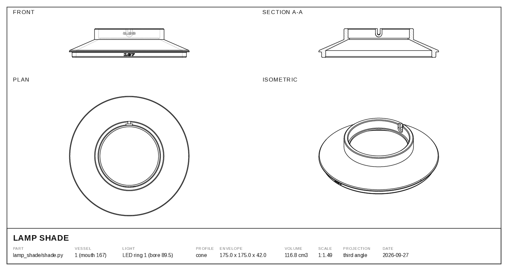

# cadkit

Drawing sheets and viewer handling for [CadQuery](https://cadquery.readthedocs.io)
models — the parts of a CAD workflow that every project needs and nobody wants
to write twice.

<picture>
  <source media="(prefers-color-scheme: dark)" srcset="docs/sheet-dark.png">
  
</picture>

<sub>Generated by `cadkit.sheet` from the solid it describes — a 3D-printed lamp
shade that seats in a 167 mm aquarium mouth and carries an LED ring light.</sub>

## What it does

Three capabilities, deliberately independent. Generating a model must not
require a viewer to be running, nor a drawing to be produced — each costs a
human interaction or seconds of compute that a plain rebuild should never pay.
`import cadkit` connects to nothing and launches nothing.

| | |
|---|---|
| **`cadkit.sheet`** | Third-angle orthographic drawing sheets |
| **`cadkit.viewer`** | Find a viewer, start one, or carry on without one |
| **`cadkit.check`** | Is this actually a sound solid? |

## Drawing sheets

```python
from cadkit import sheet

sheet.sheet(solid, "output/part_sheet.svg", "LAMP SHADE",
            fields=[("PART", "shade.py"), ("ENVELOPE", "175.0 x 175.0 x 42.0")])
```

Four views to **one common scale** — front, section, plan, isometric. Views not
drawn to a common scale are four pictures rather than a drawing, so rows are
sized to their own tallest view, letting the shared scale come out as large as
the sheet allows instead of being dictated by the squarest view.

The section is cut on the centre plane and **hatched from the solid's real cut
faces**, not from the profile that drew it — so a part whose section isn't what
its author imagined shows it here.

Sheets are **dark on screen and light on paper.** The dark palette rides on
presentation attributes and a `@media print` block carries the light one; CSS
beats presentation attributes, so a browser printing the SVG swaps itself to
black-on-white while a rasteriser keeps the dark version. The two images above
are the same file. No flag, no second export.

Call it from a part script's `__main__` beside the STEP export and the drawing
regenerates from the same solid that ships, so it cannot drift from the part it
describes.

## Viewing

```python
from cadkit import viewer

viewer.show(solid, name="part")   # False if nothing is listening — never raises
viewer.serve()                    # start one on a genuinely free port
```

`show` **never raises because no viewer is running.** A part script that dies
for want of a GUI turns "regenerate this solid" into "first go and start a
viewer", charged on every headless run. It reports and returns `False`; the
caller carries on exporting.

It uses an explicit port or `CAD_VIEWER_PORT` and never guesses at a listener,
because on a shared machine that listener may be someone else's — this is not
hypothetical, sessions here have screenshotted each other's models. A registry
of claimed ports and `free_port()` keep them out of each other's way.

```bash
python -m cadkit.viewer --status   # which viewers are up, and whose
python -m cadkit.viewer            # start one on a free port
```

## Checking

```python
from cadkit import check

report = check.solid(part)            # one body expected
report = check.solid(part, bodies=3)  # an assembly, or a part split for printing
print(report.line())                  # a verdict, always
report.require()                      # or raise, as a gate
```

Body count, geometry validity, watertightness, finite bounds, positive volume.
Each is there because its absence let something through.

A revolve of collinear samples once **built, displayed, and was garbage** — an
infinite bounding box and 284 cm³ for a part that is really 117. Nothing
raised; the viewer showed a shape. Three of these checks catch it.

Watertightness counts edges with fewer than two adjacent faces. `Shape.Closed()`
is not the test — it is a stored flag booleans don't maintain, and it reads
`False` on parts that are provably closed.

## Why not `cq.exporters.export(..., "SVG")`

Because the roll of every view it produces is arbitrary, and it fails silently.

That exporter builds its projection frame with `gp_Ax2(gp_Pnt(), gp_Dir(*projectionDir))`
— the two-argument constructor, which lets OCCT invent the X axis. OCCT's choice
is deterministic but unrelated to anything you meant, so elevations come out on
their side and isometrics upside down. The image is perfectly valid; it is
simply oriented wrong, which means nothing errors and you find out by looking.
Correcting it by rotating the output is guesswork repeated per part and per
direction.

`cadkit.sheet` takes a view direction **and** an up vector, rotates the shape so
that direction becomes +Z, and projects along a fixed axis. Orientation is
stated rather than discovered.

## Install

`cadquery` is declared as a dependency but deliberately **not** installed by
this package — the host project pins it, and adding a drawing library must not
be able to move a modelling dependency.

```bash
pip install -e . --no-deps
```

Where `pip` isn't available, a `.pth` file does the same job with no build step:

```bash
echo "$PWD/src" > <project>/.venv/lib/python3.12/site-packages/cadkit.pth
```

## Also here

[`AGENTS.md`](AGENTS.md) is the same material written for coding agents, with
the operational detail — port ownership, install layout, and the failure modes
worth inheriting.
